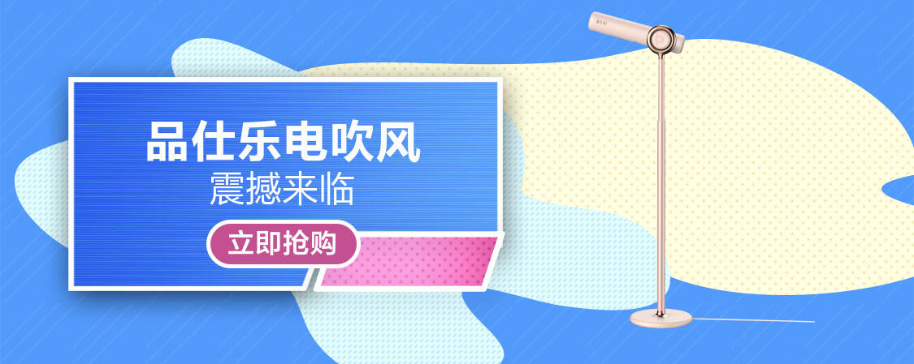

# HTML+CSS作品展示（仿写京东移动端首页②）
>  参考来源：
>
> [黑马程序员pink老师前端入门教程，零基础必看的h5(html5)+css3+移动端前端视频教程_哔哩哔哩_bilibili](https://www.bilibili.com/video/BV14J4114768?p=413)

## 效果展示：

 

<!-- more -->

## 主要功能：

使用swiper插件添加了轮播图效果

## 网页GitHub地址如下：（若加载较慢建议刷新后耐心等待一会~）

https://zhiyuanda.github.io/jdH5_swiper/

## 网页代码如下：

### HTML:

```html
<!DOCTYPE html>
<html lang="en">
<head>
    <meta charset="UTF-8">
    <meta http-equiv="X-UA-Compatible" content="IE=edge">
    <meta name="viewport" content="width=device-width, initial-scale=1.0">
    <title>jdH5</title>
    <link rel="stylesheet" href="css/normalize.css">
    <link rel="stylesheet" href="css/index.css">
    <link rel="stylesheet" href="css/swiper-bundle.min.css">
    <script src="js/swiper-bundle.min.js"></script>
    <script src="js/index.js"></script>
</head>
<body>
    <section class="app">
        <div class="close">
            
        </div>
        <div class="logo">
            
        </div>
        <div class="open1">打开京东App，购物更轻松</div>
        <div class="open2">立即打开</div>
    </section>
    <header class="search">
        <div class="list">
            
        </div>
        <div class="sou">
            <div class="left-jd"></div>
            <div class="left-icon"></div>
            <form action="">
                <input class="sousuo" type="text" placeholder="键盘鼠标套装">
            </form>
        </div>
        <div class="login"><span>登录</span></div>
    </header>
    <section class="maincontent">
        <!-- 轮播图 -->
        <div class="swiper">
            <div class="swiper mySwiper">
                <div class="swiper-wrapper">
                    <div class="swiper-slide"></div>
                    <div class="swiper-slide"></div>
                    <div class="swiper-slide"></div>
                    <div class="swiper-slide"></div>
                    <div class="swiper-slide"></div>
                </div>
                <div class="swiper-pagination"></div>
            </div>
        </div>
        <div class="nianhuo">
            
            
            
        </div>
    </section>
    <div class="mainnav">
        <ul>
            <li>
                
                <h4>京东超市</h4>
            </li>
            <li>
            <h4>京东超市</h4>
            </li>
            <li>
            <h4>京东超市</h4>
            </li>
            <li>
            <h4>京东超市</h4>
            </li>
            <li>
            <h4>京东超市</h4>
            </li>
            <li>
            <h4>京东超市</h4>
            </li>
            <li>
            <h4>京东超市</h4>
            </li>
            <li>
            <h4>京东超市</h4>
            </li>
            <li>
            <h4>京东超市</h4>
            </li>
            <li>
            <h4>京东超市</h4>
            </li>
        </ul>
    </div>
    <div class="ms">
        <div class="ms-hd">
            <h4>京东秒杀</h4>
            <p>18</p>
            
            <p>更多秒杀</p>
            
        </div>
        <div class="ms-bd">
            <li><p>￥25</p></li>
            <li><p>￥2568</p></li>
            <li><p>￥28.8</p></li>
            <li><p>￥19.7</p></li>
            <li><p>￥420</p></li>
            <li><p>￥42.9</p></li>
        </div>
    </div>
    <div class="product">
        <div class="p-left">
            
            <h4>京东商品1</h4>
            <p class="price">￥26.00</p>
            <p class="content">1万+条评论</p>
        </div>
        <div class="p-right">
            
            <h4>京东商品2</h4>
            <p class="price">￥99.90</p>
        </div>
    </div>
    <div class="product">
        <div class="p-left">
            
            <h4>京东商品1</h4>
            <p class="price">￥26.00</p>
            <p class="content">1万+条评论</p>
        </div>
        <div class="p-right">
            
            <h4>京东商品2</h4>
            <p class="price">￥99.90</p>
        </div>
    </div>
    <div class="product">
        <div class="p-left">
            
            <h4>京东商品1</h4>
            <p class="price">￥26.00</p>
            <p class="content">1万+条评论</p>
        </div>
        <div class="p-right">
            
            <h4>京东商品2</h4>
            <p class="price">￥99.90</p>
        </div>
    </div>
    <div class="product">
        <div class="p-left">
            
            <h4>京东商品1</h4>
            <p class="price">￥26.00</p>
            <p class="content">1万+条评论</p>
        </div>
        <div class="p-right">
            
            <h4>京东商品2</h4>
            <p class="price">￥99.90</p>
        </div>
    </div>
    <footer>
        <ul>
            <li><a></a></li>
            <li><a></a></li>
            <li><a></a></li>
            <li><a></a></li>
            <li><a></a></li>
        </ul>
    </footer>
</body>
</html>
```


### CSS：

```css
body {
    width: 100%;
    max-width: 540px;
    min-width: 320px;
    margin: 0 auto;
    padding: 0;
    background-color: rgb(199, 197, 197);
    font-size: 14px;
    font-family: -apple-system,Helvetica,sans-serif;
    color: #666;
    line-height: 1.5;
}
div {
    box-sizing: border-box;
}
input{
    box-shadow: none;
    border: none; 
    outline: none;
    resize: none; 
    -webkit-appearance: none;
    -webkit-tap-highlight-color: rgba(0,0,0,0); 
}
.app {
    width: 100%;
    height: 45px;
    line-height: 45px;
    text-align: center;
    background-color: #333;
}
.close {
    float: left;
    width: 8%;
    height: 45px;
}
.close img {
    width: 10px;
    height: 10px;
    vertical-align: middle;
}
.logo {
    float: left;
    padding: 0;
    width: 10%;
    height: 45px;

}
.logo img {
    width: 30px;
    height: 30px;
    vertical-align: middle;
}
.open1 {
    float: left;
    width: 57%;
    height: 45px;
    font-size: 14px;
    color: #fff;
    font-family: -apple-system, BlinkMacSystemFont, 'Segoe UI', Roboto, Oxygen, Ubuntu, Cantarell, 'Open Sans', 'Helvetica Neue', sans-serif;
    white-space: nowrap;
    overflow: hidden;
    text-overflow: ellipsis;
}
.open2 {
    float: left;
    width: 25%;
    height: 45px;
    font-size: 14px;
    color: #fff;
    background-color: #F63515;
}
.search {
    position: sticky;
    top: 0;
    width: 100%;
    max-width: 640px;
    min-width: 300px;
    background: rgb(195,12,14);
    vertical-align: middle;
}
.list {
    position: absolute;
    top: 0;
    left: 0;
    width: 40px;
    height: 44px;
}
.list img {
    display: block;
    margin: 14px 0 0 15px;
    width: 20px;
    height: 18px;
    background: url(../images/list.png) no-repeat;
    background-size: 100% 100%;
}
.sou {
    position: relative;
    height: 44px;
    line-height: 44px;
    margin: 0 50px;
}
.sousuo {
    box-sizing: border-box;
    text-overflow: ellipsis;
    padding-left: 65px;
    padding-right: 14px;
    height: 30px;
    width: 100%;
    line-height: 44px;
    font-size: 12px;
    color: #232326;
    border-radius: 15px;
}
.left-jd {
    position: absolute;
    top: 15px;
    left: 10px;
    width: 20px;
    height: 15px;
    background: url(../images/left-jd.png) no-repeat;
    background-size: 20px 15px;
}
.left-jd::after {
    content: '';
    display: block;
    position: absolute;
    top: 0;
    right: -6px;
    height: 15px;
    width: 1px;
    background-color: #ccc;
}
.left-icon {
    position: absolute;
    top: 15px;
    left: 40px;
    width: 18px;
    height: 15px;
    background: url(../images/jd-sprites.png) -80px 0 no-repeat;
    background-size: 200px auto;
}
.login {
    position: absolute;
    top: 0;
    right: 0;
    width: 40px;
    height: 44px;
    line-height: 44px;
    font-size: 14px;
    color: #fff;
}
.maincontent {
    background-color: rgb(195,12,14);
}
.nianhuo {
    height: 130px;
}
.nianhuo img:nth-child(1) {
    float: left;
    height: 100%;
    width: 30%;
}
.nianhuo img:nth-child(2) {
    float: left;
    height: 100%;
    width: 40%;
}
.nianhuo img:nth-child(3) {
    float: left;
    height: 100%;
    width: 30%;
}
.swiper {
    width: 100%;
    height: 100%;
  }

.swiper-slide {
    text-align: center;
    font-size: 18px;
    background: #fff;

    /* Center slide text vertically */
    display: -webkit-box;
    display: -ms-flexbox;
    display: -webkit-flex;
    display: flex;
    -webkit-box-pack: center;
    -ms-flex-pack: center;
    -webkit-justify-content: center;
    justify-content: center;
    -webkit-box-align: center;
    -ms-flex-align: center;
    -webkit-align-items: center;
    align-items: center;
}

.swiper-slide img {
    display: block;
    width: 100%;
    height: 100%;
    object-fit: cover;
}
ul {
    margin: 0;
    padding: 0;
}
.mainnav ul {
    /* padding: 0 0; */
    margin: 0;
    overflow: hidden;
    background-color: #fff;
}
.mainnav ul li {
    float: left;
    list-style: none;
    width: 20%;
    height: 75px;
    vertical-align: middle;
    text-align: center;
}
.mainnav li img {
    width: 40px;
    margin: 5px 0;
}
.mainnav li h4 {
    display: block;
    margin: 0 0;
    line-height: 12px;
    font-size: 12px;
    color: #ccc;
}
.ms-hd {
    width: 100%;
    overflow: hidden;
    vertical-align: middle;
    background-color: #fff;
}
.ms-hd h4 {
    display: block;
    float: left;
    margin: 2% 3%;
    font-size: 14px;
    color: #000;
}
.ms-hd p {
    display: block;
    float: left;
    margin: 2% 1%;
    font-size: 14px;
    color: #000;
}
.ms-dc {
    float: left;
    width: 5%;
    margin: 2% 1% 2% 0;
}
.ms-right {
    float: right;
    margin: 2%;
    width: 3%;
}
.ms-bd {
    padding-left: 3%;
    overflow: hidden;
    background-color: #fff;
}
.ms-bd li {
    float: left;
    overflow: hidden;
    list-style: none;
    width: 16%;
    list-style: none;
    background-color: #fff;
    font-size: 12px;
    text-align: center;
    color: red;
}
.ms-bd img {
    display: block;
    width: 100%;
    margin-right: 5px;
    margin-left: 5px;
}
.product {
    width: 100%;
    overflow: hidden;
    background-color: rgb(247,247,247);
}
.p-left {
    float: left;
    width: 46%;
    margin: 2% 2% 2% 2%;
    border-radius: 10px;
    background-color: #fff;

}
.p-left img {
    float: left;
    width: 100%;
}
.p-left h4 {
    display: inline-block;
    margin: 5px 12px;
    font-weight: normal;
    color: #000;
    box-sizing: border-box;
}
.p-left .price {
    display: inline-block;
    margin: 5px 12px;
    font-size: 18px;
    color: red;
    box-sizing: border-box;
}
.p-left .content {
    display: inline-block;
    margin: 5px 12px;
    font-size: 12px;
    color: #ccc;
    box-sizing: border-box;
}
.p-right {
    float: left;
    width: 46%;
    margin: 2% 2% 2% 2%;
    border-radius: 10px;
    background-color: #fff;
}
.p-right img {
    float: left;
    width: 100%;
}
.p-right h4 {
    display: inline-block;
    margin: 5px 12px;
    font-weight: normal;
    color: #000;
    box-sizing: border-box;
}
.p-right .price {
    display: inline-block;
    margin: 5px 12px;
    font-size: 18px;
    color: red;
    box-sizing: border-box;
}
footer {
    position: fixed;
    margin: 0;
    bottom: 0;
    left: 50%;
    transform: translateX(-50%);
    width: 100%;
    min-width: 320px;
    max-width: 540px;
    /* height: 70px; */
    background-color: #fff;
    box-shadow: 5px 5px 10px 5px rgb(0 0 0 / 30%);
    z-index: 2;
}
footer li {
    float: left;
    width: 20%;
    height: 100%;
    list-style: none;
    text-align: center;
}
footer li a {
    position: relative;
    float: left;
    text-align: center;
    text-decoration: none;
    font-size: 16px;
    line-height: 70px;
    background-color: transparent;
    cursor: pointer;
}
footer img {
    width: 100%;
    vertical-align: bottom;
    border: 0;
}
```


### JS:

```
window.addEventListener('load',function() {
    var swiper = new Swiper(".mySwiper", {
        spaceBetween: 30,
        centeredSlides: true,
        autoplay: {
          delay: 2500,
          disableOnInteraction: false,
        },
        pagination: {
          el: ".swiper-pagination",
          clickable: true,
        },
        navigation: {
          nextEl: ".swiper-button-next",
          prevEl: ".swiper-button-prev",
        },
      });
    var app = document.querySelector('.app');
    var close = document.querySelector('.close');
    close.addEventListener('click',function() {
        app.style.display = 'none';
    })
})
```

